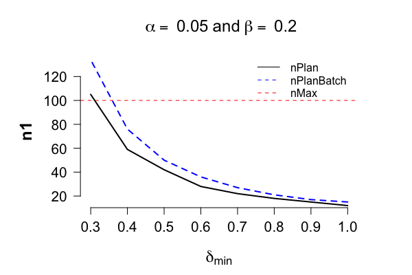

```{r, include = FALSE}
knitr::opts_chunk$set(
  collapse = TRUE,
  comment = "#>",
  fig.height = 4,
  fig.width = 8
)
```

In the previous markdown document we studied the type I error of sequential use of p-values, subjective Bayes factor and e-variables. There the conclusion was that (1) the false rejection rate is much larger than alpha if we use p-values and subjective Bayes factor sequentially, and that (2) with e-variables the type I error is guaranteed. These conclusions were illustrated by simulating under the null. 

In this document we consider the behaviour of the e-variable under the alternative, and we show how a sequential experiment can be designed. 

# sdfdsf 

Firstly, we show how to design an experiment based on safe tests [for testing means](#designT). 

Secondly, simulations are run to show that safe tests indeed conserve the type I error guarantee under optional stopping [for testing means](#optStopT). We also show that optional stopping causes the false null rejection rate of the classical p-value test to exceed the tolerable level $\alpha$ type I error guarantee. In other words, with classical tests one cannot adapt to the information acquired during the study without increasing the risk of making a false discovery. 

Lastly, it is shown that _optionally continuing non-significant experiments_ also causes the p-value tests to exceed the promised level $\alpha$ type I error guarantee, whereas this is not the case [for safe tests](#optContT).

This demonstration further emphasises the rigidity of experimental designs when inference is based on a classical test: the experiment cannot be stopped early, nor extended. Thus, the planned sample size has to be final. As such, a rigorous protocol needs to account for possible future sample sizes, which is practically impossible. Even if such a protocol can be made, there is no guarantee that the experiments go exactly according to plan, as things might go wrong during the study. <!--, and flexibility is required to act on new information.Furthermore, the failure of p-values to be robust to optional continuation implies that one cannot build on previously acquired data, thus, engage in (scientific) learning. 

simulations are run to show that safe tests also conserve the type I error guarantee under optional continuation. This implies that 

we show that the behaviour of safe tests under optional continuation. 
-->

The ability to act on information that accumulates during the study --without sacrificing the correctness of the resulting inference-- was the main motivation for the development of safe tests, as it provides experimenters with the much needed flexibility. 

## Installation
The stable version can be installed by entering in `R`:

```{r install, eval=FALSE}
install.packages("safestats")
```

The development version can be found on [GitHub](https://github.com/alexanderlynl/safestats), which can be installed with the `remotes` package from [CRAN](https://cran.r-project.org/package=devtools) by entering in `R`:

```{r remotes, eval=FALSE}
remotes::install_github("AlexanderLyNL/safestats", build_vignettes = TRUE)
```

The command 

```{r setup}
library(safestats)
```

loads the package. 

# 1. <a name = "designT">Designing safe t-test experiments</a>
## Type I error and type II errors 
To avoid bringing an ineffective medicine to the market, experiments need to be conducted in which the null hypothesis of no effect is tested. Here we show how flexible experiments based on safe tests can be designed. 

As the problem is statistical in nature, due to variability between patients, we cannot guarantee that all of the medicine that pass the test will indeed be effective. <!--This can only be accomplished by tests that never reject the null. -->
Instead, the target is to bound the type I error rate by a tolerable $\alpha$, typically, $\alpha = 0.05$. In other words, at most 5 out of the 100 ineffective drugs are allowed to pass the safe test. 

At the same time, we would like to avoid a type II error, that is, missing out on finding an effect, when there is one. Typically, the targetted type II error rate is $\beta = 0.20$, which implies that whenever there truly is an effect, an experiment needs to be designed in such a way that the effect is detect with $1 - \beta =$ 80% chance. <!-- In other words, whenever there is an effect, then 80 out of a 100 experiment should reject the null hypothesis of no effect. -->

## Case (I): Designing experiments with the minimal clinically relevant effect size known
Not all effects are equally important, especially, when a minimal clinically relevant effect size can be formulated. For instance, suppose that a population of interest has a population average systolic blood pressure of $\mu = 120$ mmHg (milimetre of mercury) and that the population standard deviation is $\sigma = 15$. Suppose further that all approved blood pressure drugs change the blood pressure by at least 9 mmHg, then a minimal clinically relevant effect size can be specified as $\delta_{\min} = (\mu_{\text{post}} - \mu_{\text{pre}}) / (\sqrt{2} \sigma) = 9 / (15 \sqrt{2} ) = 0.42$, where $\mu_{\text{post}}$ represents the average blood pressure after treatment and $\mu_{\text{pre}}$ the average blood pressure before treatment of the population of interest. The $\sqrt{2}$-term in the denominator is a result of the measurements being paired. 

Based on a tolerable type I error rate of $\alpha = 0.05$, type II error rate of $\beta = 0.20$, and minimal clinical effect size of $\delta_{\min} \approx 0.42$, the function designSafeT allows us to design the experiment as follows.
```{r}
alpha <- 0.05
beta <- 0.2
deltaMin <- 9/(sqrt(2)*15)
```
```{r, echo = FALSE}
# designObj <- designSafeT(deltaMin=deltaMin, alpha=alpha, beta=beta,
#                          alternative="greater", testType="paired", seed=1, pb=FALSE)
# save(designObj, file="safeTVignetteData/safeTDesignObject.Rdata")
load("safeTVignetteData/safeTDesignObject.Rdata")
```

```{r, eval=FALSE}
designObj <- designSafeT(deltaMin=deltaMin, alpha=alpha, beta=beta,
                         alternative="greater", testType="paired", seed=1, pb=FALSE)
```
```{r}
designObj
```
The design object defines both the parameter deltaS that will used to compute the e-value, e.g., `r designObj$parameter`, and the planned sample size(s) under optional stopping, e.g., `r designObj$nPlan`. Hence, in this case we need the pre- and post-measurements of about `r designObj$nPlan[1]` patients to detect a true effect of $\delta=\delta_{\min} \approx 0.42$. This nPlan of `r designObj$nPlan[1]` is based on continuously monitoring the e-value and stopping the experiment as soon as it exceeds $1/\alpha = 20$. Note that the event that the E-variable exceeds $1/\alpha$ is random, and the sample size at which this occurs is therefore also random. This randomness is expressed with nPlan being reported with two standard error of the mean. When it is only possible to conduct the test once, when the data are treated as a single batch, then `r designObj$nPlanBatch[1]` patients (thus `r designObj$nPlanBatch[1]-designObj$nPlan[1]` more) are needed to detect $\delta=\delta_{\min} \approx 0.42$ with 80% chance. <!--The batch planned sample size, e.g., `designObj$nPlanBatch[1]`, is non-random and serves as an upper bound for the nPlan reported above, see the [section on optional stopping](#optStopT) for further details.-->

## <a name = powerplotT>Case (II):</a> Minimal clinically relevant effect size unknown, but maximum number of samples known.
It is not always clear what the minimal clinically relevant effect size is. Suppose that the tolerable type I and type II error rates and a maximum sample size nMax, say, 100 is known due to budget constraints. In this case, the design function can be called with a reasonable range of minimal clinically relevant effect sizes, and a prospective futility analysis can be done: 

```{r, echo = FALSE}
# plotSafeTSampleSizeProfile <- plotSafeTDesignSampleSizeProfile(alpha=alpha, beta=beta,
#                                                                lowDeltaMin=0.1, highDeltaMin=1,
#                                                                nMax=100, seed=1,
#                                                                alternative="greater",
#                                                                testType="paired", nSim=1000,
#                                                                pb=FALSE)
# save(plotSafeTSampleSizeProfile, file="safeTVignetteData/plotSafeTSampleSizeProfile.Rdata")
load("safeTVignetteData/plotSafeTSampleSizeProfile.Rdata")
```
```{r, eval = FALSE}
# Recall:
# alpha <- 0.05
# beta <- 0.2
plotSafeTSampleSizeProfile <- plotSafeTDesignSampleSizeProfile(alpha=alpha, beta=beta, 
                                           lowDeltaMin=0.1, highDeltaMin=1,
                                           nMax=100, seed=1, alternative="greater", 
                                           testType="paired", nSim=1000, pb=FALSE)
```

```{r}
plotSafeTSampleSizeProfile$deltaDomain
plotSafeTSampleSizeProfile$allN1PlanSafe
```


The plot shows that when we have budget for at most 100 paired samples, we can only guarantee a power of 80% under optional stopping, if the true effect size is at least 0.35. If a field expert believes that an effect size of 0.3 is realistic, then the plot shows that we should either apply for extra grant money to test an additional `r plotSafeTSampleSizeProfile$allN1PlanSafe[8]-100` patients, or decide that it's futile to conduct this experiment, and that we should spend our time and efforts on different endeavours instead. 

# 2. <a name = "optStopT">Inference with safe tests: Optional stopping</a>
In this section we illustrate the operational characteristics of the safe t-test under optional stopping. The [next section](#optContT) studies the operational characteristics of this test under optional continuation. Robustness to these both optional stopping and continuation demonstrate that if the null hypothesis of no effect holds true, then there is less than $\alpha$ chance that the E-variable will _ever_ reject the null. After illustrating the operational characteristics of the safe test under the null, we then demonstrate its performance under the alternative. 

<!--In other words, this safe test retains its type I error guarantee regardless of how many times, and when the test is conducted, and irrespective of the experiment being data-dependently stopped or continued (discussed in the [next section](#optContT)). A safe test of level $\alpha = 0.05$ rejects the null whenever the observed e-value is larger than $20 = 1/\alpha$. -->

<!--TODO(Alexander): CHECK STRUCTURE 
Secondly, we show that there is a high chance of stopping early whenever the true effect size is at least as large as the minimal clinically relevant effect size.
-->

## Safe tests conserve the type I error rate: Batch analysis
We first show that the type I error is preserved for the batch analysis, that is, when the data are only analysed once at nPlan. 

```{r}
set.seed(1)
preData <- rnorm(n=designObj$nPlan[1], mean=120, sd=15)
postData <- rnorm(n=designObj$nPlan[2], mean=120, sd=15)
# Thus, the true delta is 0:
# deltaTrue <- (120-120)/(sqrt(2)*15)
safeTTest(x=preData, y=postData, 
          designObj=designObj, paired=TRUE)
```
or equivalently with syntax closely resembling the standard t.test code in R:

```{r}
safe.t.test(x=preData, y=postData, 
            designObj=designObj, paired=TRUE)
```
The following code replicates this simulation a 1,000 times and shows that in only a few cases will the E-variable cross the boundary of $1/\alpha$ under the null:

```{r}
# alpha <- 0.05

set.seed(1)
eValues <- replicate(n=1000, expr={
  preData <- rnorm(n=designObj$nPlan[1], mean=120, sd=15)
  postData <- rnorm(n=designObj$nPlan[2], mean=120, sd=15)
  safeTTest(x=preData, y=postData, 
            designObj=designObj, paired=TRUE)$eValue}
)

mean(eValues > 20)
mean(eValues > 20) < alpha
```

Thus, in this simulation with the null hypothesis holding true and if the safe test is only conducted once at the planned sample size, then in `r sum(eValues > 20)` out of 1,000 experiments the null hypothesis was falsely rejected. 

## Safe tests allow for early stopping without inflating the type I error rate above the tolerable $\alpha$-level
<!--### Data under the alternative: <a name = "optStopT">Stopping the experiment early</a>-->
What makes the safe tests in this package particularly interesting is that they allow for early stopping without the test exceeding the tolerable type I error rate of $\alpha$. This means that the e-value can be monitored as the data come in, and when there is a sufficient amount of evidence against the null, i.e., whenever e-value $ > 1/\alpha$, the experiment can be stopped early. This puts fewer patients at risk, and allows for more efficient scientific scrutiny. 

> Note that <a name = "martingale">not all E-variables necessarily allow for optional stopping</a>: this only holds for some special E-variables, that are also _test martingales_. More information can be found, for example, in the first author's [master thesis](https://www.universiteitleiden.nl/binaries/content/assets/science/mi/scripties/statscience/2019-2020/thesis_rjturner_for_publication.pdf), Chapter 5.

### Optional stopping does not causes safe tests to over-reject the null, but is problematic for p-values
Optionally stopping results in the type I error rate of the safe test to *not* exceed the tolerable $\alpha$ level, whereas tracking the classical p-value tests and acting on it *does* result in an overinflation of the type I error. In other words, optional stopping with these p-value tests leads to an increased risk of falsely claiming that a medicine is effective, while in reality it is not. 

```{r, echo=FALSE}
nSim <- 500L
```

The following code replicates `r nSim` experiments and each data set is generated with a true effect size set to zero. For each data set a sequential analysis is run, that is, an e-value is computed as the data come in. As soon as the e-value exceeds $1 / \alpha = 20$, the null is rejected and the experiment can be stopped. 

```{r}
# Recall:
# alpha <- 0.05
# beta <- 0.2

freqDesignObj <- designFreqT(deltaMin=deltaMin, alpha=alpha, beta=beta,
                             alternative="greater", testType="paired")
```
```{r, echo = FALSE}
# nSim <- 500L
# simResultDeltaTrueIsZero <- simulate(object=designObj, nSim=nSim, seed=1,
#                                      deltaTrue=0, freqOptioStop=TRUE,
#                                      nPlanFreq=freqDesignObj$nPlan,
#                                      muGlobal=120, sigmaTrue=15, pb=FALSE)
# simResultDeltaTrueIsZero$bootObjN1Plan <- NULL
# save(simResultDeltaTrueIsZero, file="safeTVignetteData/simResultDeltaTrueIsZero.Rdata")
load("safeTVignetteData/simResultDeltaTrueIsZero.Rdata")
```
```{r, eval = FALSE}
nSim <- 500
simResultDeltaTrueIsZero <- simulate(object=designObj, nSim=nSim, seed=1,
                                     deltaTrue=0, freqOptioStop=TRUE,
                                     nPlanFreq=freqDesignObj$nPlan,
                                     muGlobal=120, sigmaTrue=15, pb=FALSE)
```
```{r}
simResultDeltaTrueIsZero
```
Note that optional stopping always increases the chance of observing a false detection. For the safe test this increased to `r simResultDeltaTrueIsZero$safeSim$powerOptioStop*100`%, which is still below the tolerable 5%. On the other hand, tracking the p-value and rejecting the null as soon it falls below $\alpha$ leads to `r simResultDeltaTrueIsZero$freqSim$powerOptioStop*100`%, which is well above 5%. 

## Safe tests detect the effect early if it is present: deltaTrue equal to deltaMin
<!--#### Optional stopping: True effect size equals minimal clinically relevant effect size-->
In this section we illustrate the operational characteristics of the safe t-test under optional stopping, when the effect is  present. The following code replicates 500 experiments and each data set is generated with a true effect size that equals the minimal clinical-relevant effect size of $\delta_{\min}=9/(15 \sqrt{2}) \approx 0.42$. If the e-value does not exceed $1 / \alpha$, the experiment is run until all samples are collected as planned.

```{r}
# Recall:
# alpha <- 0.05
# beta <- 0.2
deltaMin <- 9/(sqrt(2)*15)      # = 0.42
```
```{r, echo = FALSE}
# simResultDeltaTrueIsDeltaMin <- simulate(object=designObj, nSim=nSim,
#                                          seed=1, deltaTrue=deltaMin,
#                                          muGlobal=120, sigmaTrue=15, pb=FALSE)
# save(simResultDeltaTrueIsDeltaMin, file="safeTVignetteData/simResultDeltaTrueIsDeltaMin.Rdata")
load("safeTVignetteData/simResultDeltaTrueIsDeltaMin.Rdata")
```
```{r, eval = FALSE}
simResultDeltaTrueIsDeltaMin <- simulate(object=designObj, nSim=nSim,
                                         seed=1, deltaTrue=deltaMin,
                                         muGlobal=120, sigmaTrue=15, pb=FALSE)
```
```{r}
simResultDeltaTrueIsDeltaMin
```
The simulations confirms that at the planned sample size there is indeed about 80% chance of detecting the minimal clinically relevant effect. The discrepancy is due to sampling error and vanishes as the number of simulations increases. 

To see the distributions of stopping times, the following code can be run

```{r}
plot(simResultDeltaTrueIsDeltaMin)
tabResult <- table(simResultDeltaTrueIsDeltaMin$safeSim$allN)
tabResult
```
The table shows the full distribution of the times at which the experiment is stopped. For instance, `r sum(tabResult[1:which(names(tabResult)==floor(designObj$nPlan[1]/2))])` out of the `r nSim` experiments stopped before half the planned sample size. In these cases we were lucky and the effect was detected early. The last bar collects all experiments that ran until the planned sample sizes, thus, also those that did not lead to a null rejection at n=`r designObj$nPlan[1]`. To see the distributions of stopping times of only the experiments where the null is rejected, we run the following code:

```{r}
plot(simResultDeltaTrueIsDeltaMin, showOnlyNRejected=TRUE)
```

## Safe tests detect the effect even earlier if it is larger than expected
<!--#### Optional stopping: True effect size larger than the minimal clinically relevant effect size-->
What we believe is clinically minimally relevant might not match reality. One advantage of safe tests is that they perform even better, if the true effect size is larger than the minimal clinical effect size that is used to plan the experiment. This is illustrated with the following code

```{r}
# Recall:
# alpha <- 0.05
# beta <- 0.2
# deltaMin <- 9/(sqrt(2)*15)      # = 0.42
deltaTrueLarger <- 0.6
```
```{r, echo = FALSE}
# simResultDeltaTrueLargerThanDeltaMin <- simulate(object=designObj,
#                                                  nSim=nSim, seed=1,
#                                                  deltaTrue=deltaTrueLarger,
#                                                  muGlobal=120, sigmaTrue=15, pb=FALSE)
# save(simResultDeltaTrueLargerThanDeltaMin, file="safeTVignetteData/simResultDeltaTrueLargerThanDeltaMin.Rdata")
load("safeTVignetteData/simResultDeltaTrueLargerThanDeltaMin.Rdata")
```
```{r, eval = FALSE}
simResultDeltaTrueLargerThanDeltaMin <- simulate(object=designObj,
                                                 nSim=nSim, seed=1,
                                                 deltaTrue=deltaTrueLarger,
                                                 muGlobal=120, sigmaTrue=15, pb=FALSE)
```
```{r}
simResultDeltaTrueLargerThanDeltaMin
```

With a larger true effect size, the power increased to `r simResultDeltaTrueLargerThanDeltaMin$safeSim$powerOptioStop*100`%. More importantly, this increase is picked up earlier by the designed safe test, and optional stopping allows us to act on this. Note that the average stopping time is now decreased, from `r simResultDeltaTrueIsDeltaMin$safeSim$nMean` to `r simResultDeltaTrueLargerThanDeltaMin$safeSim$nMean`. This is apparent from the fact that the histogram of stopping times is now shifted to the left:

```{r}
plot(simResultDeltaTrueLargerThanDeltaMin)
```

Hence, this means that if the true effect is larger than what was planned for, the safe test will detect this larger effect earlier on, which results in a further increase of efficiency. 

The last scenario with deltaTrue smaller than what was planned for, that is, deltaMin, is discussed in the context of optional continuation. 

# 3. <a name = "optContT">Optional Continuation</a>
    

## Optional continuation is problematic for p-values and leads to overinflating the type I error rate
Firstly, we show that optional continuation also causes p-values to over-reject the null. In the following we consider the situation in which we continue studies for which a first batch of data resulted in $p \geq \alpha$. These non-significant experiments are extended with a second batch of data with the same sample sizes as the first batch, that is, `r freqDesignObj$nPlan`. We see that selectively continuing non-significant experiments causes the collective rate of false null rejections to be larger than $\alpha$. 

The following code simulates `r nSim` (first batch) experiments under the null, each with the same (frequentist) sample sizes as planned for, resulting in `r nSim` p-values: 

```{r}
dataBatch1 <- generateNormalData(nPlan=freqDesignObj$nPlan,
                               deltaTrue=0, nSim=nSim, paired=TRUE, seed=1,
                               muGlobal=120, sigmaTrue=15)

pValuesBatch1 <- vector("numeric", length=nSim)

for (i in seq_along(pValuesBatch1)) {
  pValuesBatch1[i] <- t.test(x=dataBatch1$dataGroup1[i, ], 
                             y=dataBatch1$dataGroup2[i, ], 
                             alternative="greater", paired=TRUE)$p.value
}
mean(pValuesBatch1 > alpha)
sum(pValuesBatch1 < alpha)
```

Hence, after a first batch of data, we get `r sum(pValuesBatch1 < alpha)` incorrect null rejections out of a `r nSim` experiments (`r mean(pValuesBatch1 < alpha)*100`%). 

The following code continues only the non-significant `r round(mean(pValuesBatch1 > alpha)*nSim)` experiments with a second batch of data all also generated under the null, and plots two histograms. <!--In blue the histogram of all the non-significant results (954 experiments), and in red the histogram of p-values over the combined data set. -->

```{r}
selectivelyContinueDeltaTrueIsZeroWithP <-
  selectivelyContinueTTestCombineData(oldValues=pValuesBatch1,
                                      valuesType="pValues", 
                                      alternative="greater", 
                                      oldData=dataBatch1,
                                      deltaTrue=0,
                                      n1Extra=freqDesignObj$nPlan[1],
                                      n2Extra=freqDesignObj$nPlan[2],
                                      alpha=alpha,
                                      seed=2, paired=TRUE,
                                      muGlobal=120, sigmaTrue=15)
```

The blue histogram represents the distribution of the `r round(mean(pValuesBatch1 > alpha)*nSim)` non-significant p-values calculated over the first batch of data, whereas the red histogram represents the distribution of p-values calculated over the two batches of data combined. 

The commands

```{r}
pValuesBatch1To2 <- selectivelyContinueDeltaTrueIsZeroWithP$newValues
sum(pValuesBatch1To2 < alpha)
```

show that by extending the non-significant results of the first batch with a second batch of data, we got another `r sum(pValuesBatch1To2 < alpha)` false null rejections. This brings the total number of incorrect null rejections to `r sum(pValuesBatch1 < alpha)+sum(pValuesBatch1To2 < alpha)` out of `r nSim` experiments, hence, `r (sum(pValuesBatch1 < alpha) + sum(pValuesBatch1To2 < alpha))/nSim*100`%, which is above the tolerable $\alpha$-level of 5%. 

The reason why p-values over-reject the null under optional stopping and optional continuation is due to p-values being uniformly distributed under the null. As such, if the null holds true and the number of samples increases, then the p-value meanders between 0 and 1, thus, eventually crossing any fixed $\alpha$-level. 
<!-- from an original with 

combined across different experiments, for instance, from 

ASDF TODO(Alexander)
In other words, the only way to have p-values to conserve the $\alpha$-level is to stringently follow the experimental design and not deviate from it. This assumes that no problems occur during the study, which might not be realistic in practice, and makes it impossible for practitioners to adapt to new circumstances. In other words, classical p-value tests turn the experimental design into a prison for practitioners who care about controlling the type I error rate. 

With safe test one does not need to choose between correct inference and flexible experimental designs, as they were constructed to be robust to perturbations of the sampling plan. In the previous section we showed that it allows for early stopping, before the planned sample sizes. Here we also show 


One of the motivation for the development of safe tests is to help practitioners to 


construct tests that lead to decisions that remain valid under 


The previous section show that one can stop early provided experiments to be designed according to n1Plan and n2Plan. Here we show that this 


In contrast, safe tests are flexible and are not limited to the experimental design

as they are 

are flexible and do not depend 


This demonstrates how classical p-value test turn the experimental design into a prison for practitioners who care about controlling the type I error rate, which is one of the main motivation for the development of safe tests.


Safe tests also conserve the type I error rate under optional continuation. Optional continuation implies gathering more samples than was planned for because, for instance, (1) more funding came available and the experimenter wants to learn more, (2) the evidence looked promising, (3) a reviewer or editor urged the experimenter to collect more data, or (4) other researchers attempt to replicate the first finding. 

A natural way to deal with the first three cases is by computing an e-value over the combined data set. This is permitted if the data come from the same population. 

Replication attempts, however, are typically based on samples from a different population. One way to deal with this is by multiplying the e-value computed from the original study with the e-value computed from the replication attempt. 

We show that both procedures are safe, that is, they do not lead to the tolerable type I error rate be exceeded, whereas classical p-values once again over-reject. 
-->

## Two ways to optionally continue studies with safe tests
Safe tests, as we will show below, do conserve the type I error rate under optional continuation. Optional continuation implies gathering more samples than was planned for because, for instance, (1) more funding came available and the experimenter wants to learn more, (2) the evidence looked promising, (3) a reviewer or editor urged the experimenter to collect more data, or (4) other researchers attempt to replicate the first finding. 

A natural way to deal with the first three cases is by computing an e-value over the combined data set. This is permitted if the data come from the same population, and if the E-variable used is a [_test martingale_](#martingale), which is the case for the problem at hand. 

Replication attempts, however, are typically based on samples from a different population. One way to deal with this is by multiplying the e-value computed from the original study with the e-value computed from the replication attempt. In this situation, the e-value formula for the replication study could also be _redesigned_ through the \code{design} function, for example when more information on nuisance parameters or effect size has become available for designing a more powerful test.

We show that both procedures are safe, that is, they do not lead to exceedance of the tolerable type I error rate, as was the case with classical p-values. 

### i. Optional continuation by _extending_ the experiment does not result in safe tests exceeding the tolerable $\alpha$-level
In this subsection, we show that only continuing studies for which the e-value $\leq 1/ \alpha$ does *not* lead to an over-rejection of the null. This is because the sampling distribution of e-values under the null slowly drifts towards smaller values as the number of samples increases. 

Again, we consider the situation in which we only continue studies for which the original e-values did not lead to a null rejection. For the first batch of e-values, we use the simulation study ran in the previous section, and we recall that under optional stopping we get 

```{r}
dataBatch1 <- list(dataGroup1=simResultDeltaTrueIsZero$safeSim$dataGroup1,
                   dataGroup2=simResultDeltaTrueIsZero$safeSim$dataGroup2)

eValuesBatch1 <- simResultDeltaTrueIsZero$safeSim$eValues
sum(eValuesBatch1 > 1/alpha)
```

thus, `r sum(eValuesBatch1 > 1/alpha)` false null rejections out of `r nSim` experiments. 

The follow-up batches of data will be of the same size as the original, thus, `r designObj$nPlan`, and will also be generated under the null. The slow drift to lower e-values is visualised by two histograms. The blue histogram represents the sampling distribution of e-values of the original simulation study that did not resulted in a null rejection. The red histogram represents the sampling distribution of e-values computed over the two batches of data combined. To ease visualisation, we plot the histogram of the logarithm of e-values; a negative log e-value implies that the e-value is smaller than one, whereas a positive log e-values corresponds to e-values larger than one. For this we run the following code:

```{r}
selectivelyContinueDeltaTrueIsZero <- 
  selectivelyContinueTTestCombineData(oldValues=eValuesBatch1,
                                      designObj=designObj,
                                      alternative="greater", 
                                      oldData=dataBatch1,
                                      deltaTrue=0,
                                      seed=2, paired=TRUE,
                                      muGlobal=120, sigmaTrue=15,
                                      moreMainText="Batch 1-2")
```

Note that compared to blue histogram, the red histogram is shifted to the left, thus, the sampling distribution of e-values computed over the two batches combined concentrates on smaller values. In particular, most of the mass remains under the threshold value of $1/\alpha$, which is represented by the vertical grey line $\log(1/\alpha) \approx 3.00$. This shift to the left is caused by the increase in sample sizes from n1=n2=`r designObj$nPlan[1]` to n1=n2=`r 2*designObj$nPlan[1]`. The commands 

```{r}
eValuesBatch1To2 <- selectivelyContinueDeltaTrueIsZero$newValues
sum(eValuesBatch1To2 > 1/alpha)
length(eValuesBatch1To2)
```

show that `r sum(eValuesBatch1To2 > 1/alpha)` out of the `r length(eValuesBatch1To2)` of the selectively continued experiments (`r mean(eValuesBatch1To2 > 1/alpha)*100`%) now lead to a false null rejection due to optional continuation. Hence, after the second batch of data the total number of total number of false null rejections is `r sum(eValuesBatch1 > 1/alpha) + sum(eValuesBatch1To2 > 1/alpha)` out of a total of a `r nSim` original experiments, thus, `r (sum(eValuesBatch1 > 1/alpha) + sum(eValuesBatch1To2 > 1/alpha))/nSim*100`%. Similar, a third batch won't increase the collective false rejection rate either. 

```{r}
eValuesBatch1To2 <- selectivelyContinueDeltaTrueIsZero$newValue
dataBatch1To2 <- selectivelyContinueDeltaTrueIsZero$combinedData

selectivelyContinueDeltaTrueIsZero <- 
  selectivelyContinueTTestCombineData(oldValues=eValuesBatch1To2,
                                      designObj=designObj,
                                      alternative="greater", 
                                      oldData=dataBatch1To2,
                                      deltaTrue=0,
                                      seed=3, paired=TRUE, 
                                      muGlobal=120, sigmaTrue=15,
                                      moreMainText=paste("Batch: 1 to", 3))
sum(selectivelyContinueDeltaTrueIsZero$newValues > 1/alpha)
```
Another batch yields e-values so small that it leads to an underflow. 

#### When the effect is present optional continuation results in safe tests correctly rejecting the null
The slow drift of the sampling distribution of e-values to smaller values is replaced by a fast drift to large values whenever there is an effect. We again consider the situation in which we continue studies for which the first batch of e-values did not lead to a null rejection. For this we consider the case with deltaTrue smaller than deltaMin. 

```{r, echo = FALSE}
# simResultDeltaTrueLessThanDeltaMin <- simulate(object=designObj, nSim=nSim,
#                                                seed=1, deltaTrue=0.3,
#                                                muGlobal=120, sigmaTrue=15, pb=FALSE)
# save(simResultDeltaTrueLessThanDeltaMin, file="safeTVignetteData/simResultDeltaTrueLessThanDeltaMin.Rdata")
load("safeTVignetteData/simResultDeltaTrueLessThanDeltaMin.Rdata")
```
```{r, eval = FALSE}
simResultDeltaTrueLessThanDeltaMin <- simulate(object=designObj, nSim=1000L,
                                               seed=1, deltaTrue=0.3,
                                               muGlobal=120, sigmaTrue=15, pb=FALSE)
```
```{r}
simResultDeltaTrueLessThanDeltaMin
```

The follow-up batch of data will again be of the same sizes, thus, `r designObj$nPlan`, and be generated with the same deltaTrue smaller than deltaMin, as in the first batch. 

As a first batch of e-values, we use the simulation study ran in the previous section when deltaTrue equals deltaMin, and we recall that under optional stopping we get 

```{r}
dataBatch1 <- list(
  dataGroup1=simResultDeltaTrueLessThanDeltaMin$safeSim$dataGroup1,
  dataGroup2=simResultDeltaTrueLessThanDeltaMin$safeSim$dataGroup2
)

eValuesBatch1 <- simResultDeltaTrueLessThanDeltaMin$safeSim$eValues
sum(eValuesBatch1 > 1/alpha)
```

`r sum(eValuesBatch1 > 1/alpha)` correct null rejections, since this simulation is based on data generated under alternative with deltaTrue > 0. 

The following code selectively continues the `r nSim-sum(eValuesBatch1 > 1/alpha)` experiments which did not lead to a null rejection:

```{r}
selectivelyContinueDeltaTrueLessThanDeltaMin <- 
  selectivelyContinueTTestCombineData(oldValues=eValuesBatch1,
                                      designObj=designObj,
                                      alternative="greater", 
                                      oldData=dataBatch1,
                                      deltaTrue=deltaMin,
                                      seed=2, paired=TRUE, muGlobal=120,
                                      sigmaTrue=15)
```

The plot shows that after the second batch of data that the sampling distribution of e-values now concentrates on larger values, as is apparent from the blue histogram shifting to the red histogram on the right. Note that most of the red histogram's mass is on the right-hand side of the grey vertical line that represents the $\alpha$ threshold (e.g., $\log(1/\alpha) \approx 3$. The continuation of the `r nSim-sum(eValuesBatch1 > 1/alpha)` experiments with $E < 1/\alpha=20$ led to 

```{r}
eValuesBatch1To2 <- selectivelyContinueDeltaTrueLessThanDeltaMin$newValues
sum(eValuesBatch1To2 > 1/alpha)
```

an additional `r sum(eValuesBatch1To2 > 1/alpha)` correct null rejections (`r sum(eValuesBatch1To2 > 1/alpha)/sum(eValuesBatch1 < 1/alpha)*100`% of `r sum(eValuesBatch1 < 1/alpha)` experiments). This brings up the total number of null rejections to `r sum(eValuesBatch1To2 > 1/alpha) + sum(eValuesBatch1 > 1/alpha)` out of the `r nSim` experiments. In this case, a null rejection is correct, since the data were generated with a true effect larger than zero, though smaller than the minimal clinically relevant effect size. 

### ii. Optional continuation through replication studies
It is not always appropriate to compute one e-value over a combine data set, in particular for replication attempts where the original experiment is performed on a different population. In that case, one can still easily do safe inference by multiplying the e-values computed over each data set separately. This procedure also conserves the $\alpha$-level, as we show below. 

In all scenarios the simulation results of the optional stopping studies are used as original experiments. The data from these simulated experiments were all generated with a global population mean (e.g., baseline blood pressure) that was set to $\mu_{g}=120$, a population standard deviation of $\sigma=15$, and a deltaTrue, which depending on the absence or presence of the effect was zero, or equal to deltaMin, respectively. 

#### Type I error is guaranteed when multiplying e-values
We continue the e-values from the optional stopping simulation study

```{r}
eValuesOri <- simResultDeltaTrueIsZero$safeSim$eValues
```

The code below multiplies these original e-values with e-values observed in a replication attempt with a larger sample size. As in the original study the data are generated under the null. Suppose that for the replication attempt we now administer the same drug to a clinical group that has a lower overall baseline blood pressure of $\mu_{g}=90$ mmHg and standard deviation of $\sigma=6$. 

```{r}
# Needs to be larger than 1/designObj$n1Plan to have at least two samples 
# in the replication attempt
someConstant <- 1.2

repData <- generateNormalData(nPlan=c(ceiling(someConstant*designObj$nPlan[1]),
                                     ceiling(someConstant*designObj$nPlan[2])),
                             deltaTrue=0, nSim=nSim, 
                             muGlobal=90, sigmaTrue=6,
                             paired=TRUE, seed=2)

eValuesRep <- vector("numeric", length=nSim)

for (i in seq_along(eValuesRep)) {
  eValuesRep[i] <- safeTTest(x=repData$dataGroup1[i, ], 
                          y=repData$dataGroup2[i, ], 
                          designObj=designObj,
                          paired=TRUE)$eValue
}
eValuesMultiply <- eValuesOri*eValuesRep
mean(eValuesMultiply > 1/alpha)
```

This shows that the type I error (`r mean(eValuesMultiply > 1/alpha)*100`% < $\alpha=5$%) is still controlled for, even if the replication attempt is done on a different population. In fact, the $\alpha$-level is controlled for regardless of the values of the nuisance parameters (e.g., $\mu_{g}$ and $\sigma$), or the sample sizes of the replication attempt as long as there are more than 2 data points in any study. 
<!--(i.e., "someConstant" as long as it is larger than the minimal sample size of 2) used in the replication attempt. -->

#### Multiplying e-values under the alternative
As original experiments we now take the e-values from the optional stopping simulation study with deltaTrue equal to deltaMin:

```{r}
eValuesOri <- simResultDeltaTrueIsDeltaMin$safeSim$eValues
```

The code below multiplies these original e-values with e-values based on replication data, which as in the original study are generated under deltaTrue equal to deltaMin, but with different nuisance parameters, e.g., $\mu_{g}=110$ and $\sigma=50$, thus, much more spread out than in the original studies. Again the replication attempt is assumed to have a larger sample size. 

```{r}
someConstant <- 1.2

repData <- generateNormalData(nPlan=c(ceiling(someConstant*designObj$nPlan[1]),
                                     ceiling(someConstant*designObj$nPlan[2])), 
                             deltaTrue=deltaMin, nSim=nSim, 
                             muGlobal=110, sigmaTrue=50,
                             paired=TRUE, seed=2)

eValuesRep <- vector("numeric", length=nSim)

for (i in seq_along(eValuesRep)) {
  eValuesRep[i] <- safeTTest(x=repData$dataGroup1[i, ], 
                          y=repData$dataGroup2[i, ], 
                          designObj=designObj,
                          paired=TRUE)$eValue
}
eValuesMulti <- eValuesOri*eValuesRep
mean(eValuesMulti > 1/alpha)
```
This led to `r sum(eValuesMulti > 1/alpha)` null rejections out of the `r nSim` experiments, which is the correct result as the effect is present in both the original and replication studies. 

## Conclusion
We believe that optional continuation is essential for (scientific) learning, as it allows us to revisit uncertain decisions such as ($p < \alpha$ and e-value $> 1/\alpha$) either by extending an experiment directly, or via replication studies. Hence, we view learning as an ongoing process, which requires that inference becomes more precise as data accumulate. The inability of p-values to conserve the $\alpha$-level under optional continuation, however, is at odds with this view --by gathering more data after an initial look, the inference becomes less precise, as the likelihood of the null being true after observing $p < \alpha$ increases beyond what is tolerable. 

Safe tests on the other hand benefit from more data, as the chance of seeing e-value $> 1/\alpha$ (slowly) decreases when the null is true, whereas it (quickly) increases when the alternative is true, as the number of samples increases.  

<!-- Hence, more 

Learning from data is a continuous process, which is based on the principle that as more data accumulate the inference becomes more precise. We hope to have shown that inference based on p-values 


Optional continuation 

We believe that as more data accumulates that inference should become more precise. This 

inference is a continuous process, and that as more data accumulates one should make more precise inference. 

We hope to have highlighted the problem of optional stopping and optional 

illustrated how both optional stopping and optional continuation causes the p-values to over-reject the null. This means that both intuitive 

As such, making an observed $p< \alpha$ less informative, as it might well be due to the null hypothesis of no effect being true. This is particularly paradoxical for p-values under optional continuation, where one would expect that more data would provides more accurate inference. The inflation of the type I error implies otherwise

Robustness to optional continuation implies that intuitive actions such as 

In particular, when the null is true, then extending the experiment retains bounds the chance 

the chance of observing a low e-value remains high, 
-->
<!--
## Subconclusion
The goal the simulation studies is to illustrate the theoretical properties of safe tests developed [here](https://arxiv.org/abs/1906.07801). 

We hope to have illustrated how intuitive actions, such as monitoring the evidence and stopping early, or acquiring additional data causes the p-value to over-reject the null, thus, yielding incorrect inferences. This means that regardless of the null being true, or that there was actually an effect, the chances of 

Regardless of the presence or absence of an effect, optional stopping and optional continuation leads to an increased chance of observing $p>\alpha$, in particular, larger than $\alpha$. Especially paradoxical is the fact that optional continuation results in an over-rejection of the null, which, thus, implies that more data leads to 

As such, when confronted with $p>\alpha$ it is unclear whether the null or alternative were true. 

In contrast, when the null is true, then optional continuation actually decreases the chances of observing a large e-value, whereas if the alternative is true, then optional continuation increases the chances of observing a large e-value. This coincides with our general belief that more data provides us with more information, whereas with p-values it provides us with less information. 


the problems with classical p-values, when

the simulations show that safe tests are indeed robust to the sample sizes used in the experiment. 

that with safe tests lead to anytime valid inference, by which we mean that the conclusions remain valid regardless of one's intention to stop or to continue a study. 


Following intuition more data provides more information, whereas with p-values we get incorrect results. 

More data under the null makes chance of getting a large e-values small, whereas more data under the alternative increases the chance of observing a large e-value. 


it really doesn't matter how the 


 (n1Plan) 

on the theoretical properties 

We believe that optional stopping is the moral 

Optional continuation is of fundamental importance for science in general, as it allows us to engage to build on previous 

The latter section combined with the previous one shows e-values are robust to changes in the sample sizes of the experiment. In particular, it means that when 


This means that whenever we extend a non-rejected experiment we minimise the chance of 

This means that we reject the nullcome to the right conclusions whenever 

regardless if we 

that it does not matter whether 


monitored and 
-->

<!--
#### Subconclusion
Hence, as e-values are robust to both optional stopping and optional continuation 

Optional continuation is fundamental as it allows us to build upon previous work and 

As such, we conclude that safe tests are robust to pertubations of the experimental design. In particular, one remain convinced that 

We hope to have shed some light on how e-values are robust to the design of the experiment. This 
-->

<!-- TODO: move all two proportions instructions to separate vignette and update to the new
stream data setting
# Tests of two proportions
## 1. <a name = "design2x2">Designing Safe Experiments</a>
The safestats package also contains a safe alternative for tests of two proportions. The standard tests for this setting, which cannot deal with optional stopping, are Fisher’s exact test or the chi-squared test. These tests are applicable to data collected from two groups (indicated with "a" and "b" from here), where each data point is a binary outcome 0 (e.g., deceased) or 1 (e.g., survived). For example, group "a" might refer to the group of patients that are given the placebo, whereas group "b" is given the drug. 


### Case (I): Designing experiments with the minimal clinically relevant effect size known
As with the t-test, we might know the minimal clinically relevant effect size upfront for our test of two proportions. For example, we might only be interested in further researching or developing a drug when the difference in the proportion of cured patients in the treatment group compared to the placebo group is at least 0.3. In practice this implies, for example, that when 20% of patients get cured on average in the placebo group, we want the drug to add at least 30% to this average, so in the treated group 50% of patients should be cured. We could design a safe test for this study:

```{r }
# safeDesignProportions <- designSafeTwoProportions(deltaMin=0.3, alpha=0.05,
#                                                   beta=0.20, lowN=100,
#                                                   numberForSeed = 5227)
```
For detecting this difference with a power of at least 80%, while testing at significance level 0.05, we would need:

```{r }
#safeDesignProportions$n.star
```

patients. 

A safe test could now be performed with this design object; for this, some mock data are generated below:

```{r }
# sampleExample <- as.table(matrix(c(10, safeDesignProportions[["na"]]-10, 40,
#                                    safeDesignProportions[["nb"]]-40), 
#                                  byrow=TRUE, nrow=2))
# colnames(sampleExample) <- c(0, 1)
# sampleExample
```

Performing the safe test:

```{r }
#safeTwoProportionsTest(x = sampleExample, testDesign = safeDesignProportions)
```

### Case (II): Minimal clinically relevant effect size unknown, but maximum number of samples known.
We might not have enough resources to fund our study to detect the minimal difference of 0.3. For example, we might only have funds to treat 50 patients in each group, so 100 in total. If this is the case, we could, [just as with the t-test](#powerplotT), inspect the minimal number of patients we need for the experiment to achieve a power of 80% at our significance level per effect size of interest:

```{r }
# plotResult <- plotSafeTwoProportionsSampleSizeProfile(alpha=0.05,
#                                                       beta=0.20,
#                                                       highN=200, 
#                                                       maxN=100,
#                                                       numberForSeed=5222)
```

Observe that the smallest absolute difference detectable with our available resources is 0.4; we might have to cancel the study, or try to acquire more research funds, as with our current funds, we can not guarantee a high enough power for detecting the difference between the groups we are interested in. This implies that, when a non-significant result is obtained, we would be unsure whether this was caused by our underpowered study, or because there was really no difference between the groups.

Furthermore, the plot also shows the _expected sample sizes_ under optional stopping. The plot function generates experiments based on the minimal difference corresponding to the x-axis and carries out a simulation with _optional stopping_, i.e., experiments were stopped early as soon as $S > 1/\alpha=20$ was observed, and the realised average number of patients was calculated. Observe that the difference between the planned sample size and the sample size under optional stopping is substantial. In the next section, the behaviour of the safe test for two proportions and Fisher's exact test under optional stopping is studied further.

## 2. Inference with Safe Tests and <a name = "optStop2x2">Optional Stopping</a>
#### True effect size equals minimal clinically relevant effect size
As with the safe t-test, the safe test for two proportions can be used in the optional stopping setting while retaining the type I error guarantee. In the figure below the spread of the stopping times among 1,000 simulated experiments is depicted, if the real effect size equals the minimal clinically relevant effect size as planned:

```{r }
# set.seed(5224)
# 
# optionalStoppingTrueMeanIsDesign <- 
#   simulateSpreadSampleSizeTwoProportions(
#     safeDesign=safeDesignProportions, M=1000,
#     parametersDataGeneratingDistribution=c(0.3, 0.6))
# 
# plotHistogramDistributionStoppingTimes(
#   optionalStoppingTrueMeanIsDesign, 
#   nPlan=safeDesignProportions[["n.star"]], 
#   deltaTrue = 0.3)
```

We designed the safe test such that we had a minimal power of 0.8, would the data truly come from a distribution with an absolute difference of 0.3 between the proportions of cured patients in the groups. Has this power been achieved?

```{r }
#power achieved:
#mean(optionalStoppingTrueMeanIsDesign$rejected == 1)
```

#### True effect size larger than the minimal clinically relevant effect size
We have designed the safe test for a minimal clinically relevant effect size, but what would happen if the difference between the groups was even larger in reality, i.e., if the drug had an even bigger effect?

```{r }
# set.seed(5224)
# 
# optionalStoppingTrueDifferenceBig <- 
#   simulateSpreadSampleSizeTwoProportions(
#     safeDesign=safeDesignProportions, M=1000, 
#     parametersDataGeneratingDistribution = c(0.2, 0.9))
# 
# plotHistogramDistributionStoppingTimes(
#   optionalStoppingTrueDifferenceBig, nPlan=safeDesignProportions[["n.star"]],
#   deltaTrue = 0.7)
```

We would stop, on average, even earlier! The power of the experiment also increases:

```{r }
#power achieved:
#mean(optionalStoppingTrueDifferenceBig$rejected == 1)
```

#### Data under the null: True effect size is zero, thus, much smaller than the minimal clinically relevant effect size
We can also illustrate what would happen under optional stopping, when our *null hypothesis* that there is no difference between the effect of the drug and the placebo is true:

```{r }
# set.seed(5224)
# 
# optionalStoppingTrueMeanNull <- 
#   simulateSpreadSampleSizeTwoProportions(
#     safeDesign=safeDesignProportions, M=1000, 
#     parametersDataGeneratingDistribution = c(0.5, 0.5))
# 
# plotHistogramDistributionStoppingTimes(
#   optionalStoppingTrueMeanNull, 
#   nPlan=safeDesignProportions[["n.star"]], 
#   deltaTrue = 0)
```

The type I error rate has stayed below 0.05:

```{r }
# The rate of false null rejections remained under alpha=0.05
#mean(optionalStoppingTrueMeanNull$rejected == 1)
```

#### Classical test "Fisher's exact test" under the null with optional stopping
Optional stopping, however, causes Fisher's exact test to over-reject the null. When the null is true, the rate of incorrect null rejections exceeds the tolerable $\alpha$-level:

```{r }
# set.seed(5224)
# 
# fisher_result <- simulateFisherSpreadSampleSizeOptionalStopping(
#   deltaDesign=0.5, alpha=0.05, nDesign=safeDesignProportions$n.star, 
#   power=0.8, M=100, parametersDataGeneratingDistribution=c(0.5, 0.5))
# 
# mean(fisher_result$rejected == 1)
```
Thus, 20% which is four times as much as promised. 

## 3. <a name = "optCont2x2">Optional Continuation </a>for tests of two proportions
In each of the simulations above, a fraction of the experiments did not lead to the rejection of the null hypothesis. Since safe tests allow for optional continuation, one could decide to plan a replication experiment after such a 'failed' first experiment, for example when the e-value looks promisingly high. The resulting e-values from these replication studies could then be multiplied to calculate a final e-value.

We are now going to zoom in on two of the optional stopping simulations we carried out above, where the true difference between the groups equalled our design difference (0.3), and where the true difference equalled 0. In the experiment where the true difference was 0.3, we did not reject the null in 13.2% of the studies. If we now imagine the situation we would encounter in reality, where we would not know that we were really sampling from the alternative hypothesis, how high should e-values then be to support starting a replication study? To give us some handles, we could look at the spread of e-values from studies where the null was not rejected, from our experiments under the null and under the alternative:

```{r}
# notRejectedIndex <- which(optionalStoppingTrueMeanIsDesign$rejected==FALSE)
# eValuesNotRejected <- optionalStoppingTrueMeanIsDesign$s_values[notRejectedIndex]
# nullNotRejectedIndex <- which(optionalStoppingTrueMeanNull$rejected == FALSE)
# eValuesNotRejectedNull <- optionalStoppingTrueMeanNull$s_values[nullNotRejectedIndex]
```
```{r, echo = FALSE}
# trueHist <- graphics::hist(x = eValuesNotRejected, plot = FALSE)
# nullHist <- graphics::hist(x = eValuesNotRejectedNull, plot = FALSE)
# yMax <- max(trueHist[["counts"]], nullHist[["counts"]])
# graphics::par(cex.main=1.5, mar=c(5, 6, 4, 4)+0.1, mgp=c(3.5, 1, 0), cex.lab=1.5,
#               font.lab=2, cex.axis=1.3, bty="n", las=1)
# graphics::plot(nullHist, xlim = c(0, max(eValuesNotRejected, eValuesNotRejectedNull)), 
#                freq = FALSE, col = "blue", density = 20, angle = 45, xlab = "e-values", 
#                main = "Histogram of e-values where null not rejected")
# graphics::plot(trueHist, add = TRUE, freq = FALSE, col = "red", density = 20, 
#                angle = -45)
# graphics::legend(x = "topright", legend = c("True delta: null", "True delta: design"), fill = c("blue", "red"))
```

It can be observed that, when the true difference between the groups equals our design difference, the e-values are spread out between 0 and 13. On the other hand, with our experiment under the null, all e-values were smaller than 8.

Based on this plot we could for example conclude that studies that yielded a final e-value between 10 and 20 look promising; under the null hypothesis, such high e-values were not observed in the spread plot! What would happen if we followed these studies up with a small extra study with 40 participants, and combined the resulting e-values? How many of the initially futile experiments will now lead to rejection of the null hypothesis?

```{r optionalContinuation2x2}
# continueIndex <- which(optionalStoppingTrueMeanIsDesign$s_values < 20 & 
#                          optionalStoppingTrueMeanIsDesign$s_values > 10)
# 
# interestingEValues <-
#   optionalStoppingTrueMeanIsDesign$s_values[continueIndex]
# 
# newEValues <- 
#   simulateOptionalContinuationTwoProportions(
#     interestingEValues, nFollowUp=40, 
#     parametersDataGeneratingDistribution=c(0.3, 0.6))
# 
# mean(newEValues>=20)
```

What happens when we apply this optional continuation when the data are truly generated under the null hypothesis? (note that we relax our bound of initial 'interesting' e-values here to 1, otherwise there would be no e-values to continue with)

```{r optionalContinuation2x2Null}
# continueIndex <- optionalStoppingTrueMeanNull$s_values < 20 & 
#   optionalStoppingTrueMeanNull$s_values > 1
# 
# interestingEValues <-optionalStoppingTrueMeanNull$s_values[continueIndex]
# 
# newEValues <- 
#   simulateOptionalContinuationTwoProportions(
#     interestingEValues, nFollowUp=40, 
#     parametersDataGeneratingDistribution=c(0.5, 0.5))
# 
# mean(newEValues>=20)
```
We still keep our type-I error probability guarantee.

## Short examples of usage of other testing scenarios for two proportions
Some short examples with code snippets for other testing scenarios are illustrated.

#### One-sided testing
Safe tests for two proportions can also be designed for one-sided testing. For the case when one hypothesizes that the population mean of group "a" is higher than the population mean of group "b":

```{r }
# safeDesignProportionsOneSided <- 
#   designSafeTwoProportions(deltaMin=0.5, alternative="greater",
#                            numberForSeed = 291202)
```

We can now simulate data that fit our hypothesis (more 1s observed in group "a" than in "b"):

```{r }
# sampleExampleGreater <- 
#   as.table(matrix(c(5, safeDesignProportionsOneSided[["na"]]-5, 19,
#                     safeDesignProportionsOneSided[["nb"]]-19), 
#                   byrow=TRUE, nrow=2))
# 
# colnames(sampleExampleGreater) <- c(0,1)
# sampleExampleGreater
```

This yields a high e-value:

```{r }
# safeTwoProportionsTest(x=sampleExampleGreater, 
#                        testDesign=safeDesignProportionsOneSided)
```

But if we now observe the opposite, more 1s in group "b" than in "a", the e-value will be low;

```{r }
# sampleExampleLesser <- 
#   as.table(matrix(c(safeDesignProportionsOneSided[["na"]]-5, 5,
#                     safeDesignProportionsOneSided[["nb"]]-19, 19), 
#                   byrow=TRUE, nrow=2))
# 
# colnames(sampleExampleGreater) <- colnames(sampleExampleLesser) <- c(0,1)
# sampleExampleLesser
```

```{r }
# safeTwoProportionsTest(x=sampleExampleLesser,
#                        testDesign=safeDesignProportionsOneSided)
```

#### Unbalanced design: unequal group sizes
When a balanced design is not possible, a safe test of two proportions for unequal sample sizes can be designed as well; the final ratio between the sample sizes one is going to collect has to be known for this.

```{r }
# safeDesignProportionsImbalanced <- 
#   designSafeTwoProportions(deltaMin=0.3, alpha=0.05, beta=0.20, lowN=120,
#                            sampleSizeRatio=2)
# safeDesignProportionsImbalanced
```
untill here -->
