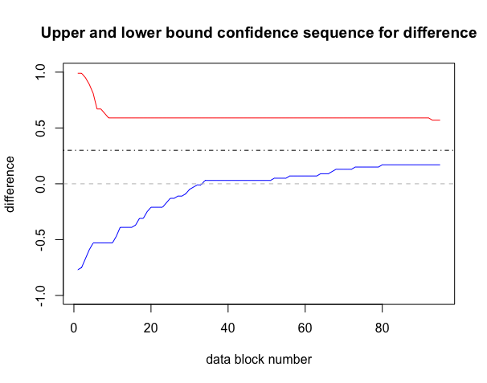
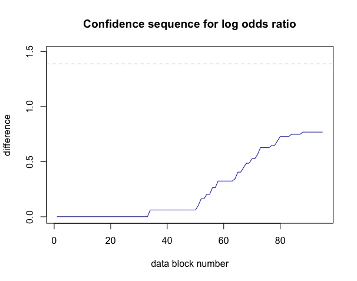

```{r setup, include = FALSE}
knitr::opts_chunk$set(
  collapse = TRUE,
  comment = "#>",
  fig.height = 4,
  fig.width = 8
)

library(safestats)
```

## Introduction
The safestats package contains safe alternatives for tests of two proportions. These tests are applicable to data collected from two groups (indicated with "a" and "b" from here), where each data point is a binary outcome 0 (e.g., ill) or 1 (e.g., cured). For example, group "a" might refer to the group of patients that are given the placebo, whereas group "b" is given the drug. The tests highlighted in this vignette have been designed specifically for an _optional stopping_ setting, where one analyses research data as it comes in in real-time and wants to make a decision about the hypotheses as quickly as possible. The standard tests for this setting, which cannot deal with optional stopping, are Fisher’s exact test or the chi-squared test. 

In this vignette we will first describe how you can [design, plan and execute](#design2x2) safe experiments, based on desired significance levels, power and minimal clinically relevant differences or odds ratios with the functions in the safestats package. Next, we illustrate how power of experiments can be increased and how experiments can be finished quicker through [optional stopping](#optStop2x2), and how borderline significant experiments can be continued through [optional continuation](#optCont2x2) with safe testing. We also show how to build safe [confidence intervals and confidence](#confInt) sequences.

The main aim for this vignette is to give practical code examples and some intuition into optional stopping and continuation scenarios through numerical illustrations; details and theoretical backgrounds can be found in [our paper (Turner, 2021)](#TurnerRef).

## 1. <a name = "design2x2"></a>Designing Safe Experiments
Before we can start an experiment, to be able to do optional stopping with safe tests, we have to decide on the incoming *data block size*. A block is a set of data  consisting of $n_a$ outcomes in group $a$ and $n_b$ outcomes in group $b$, for some pre-specified $n_a$ and $n_b$. One is allowed to perform a safe test and look at the results each time a new block is complete. Therefore, one should choose these blocks as small as possible, enabling the user to collect information as quickly as possible. For example, if we consider a balanced design, it is best to choose $n_a = 1$ and $n_b = 1$. Imagine a clinical trial researcher starting up their computer after the weekend and seeing that data of 15 patients have been processed in a control group, and 12 in a case group. The researcher could then perform the safe test with the data of the first 12 patients from each group, as 12 complete "blocks" with one patient from each group are present.

The safe tests functions expect numeric vectors giving the number of successes per block as arguments. An example of observed data in the correct format for the package with 10 blocks with $n_a = n_b = 1$ could be:

```{r}
ya <- c(1,1,1,1,1,1,0,1,1,1)
yb <- c(0,0,1,0,1,0,0,0,0,0)
```

### Case (I): Designing experiments with the minimal clinically relevant effect size known
We might know the minimal clinically relevant effect size upfront for our test of two proportions. For example, we might only be interested in further researching or developing a drug when the difference ("delta" in the code) in the proportion of cured patients in the treatment group compared to the placebo group is at least 0.3. In practice this implies, for example, that when 20% of patients get cured on average in the placebo group, we want the drug to add at least 30% to this average, so in the treated group 50% of patients should be cured. We could design a safe test that achieves a power of 80% while testing at the relatively standard significance level of 0.05 in this setting:

```{r, echo = FALSE}
set.seed(1082021)
# balancedSafeDesign <- designSafeTwoProportions(
#   na = 1,
#   nb = 1,
#   alpha = 0.05, #significance level for testing
#   beta = 1 - 0.8, #power 80% equals type II error (beta) of 0.2
#   delta = 0.3
# )
# save(balancedSafeDesign, file="safe2x2DesignObject.Rdata")
load("safe2x2VignetteData/safe2x2DesignObject.Rdata")
```
```{r, eval=FALSE}
balancedSafeDesign <- designSafeTwoProportions(
  na = 1,
  nb = 1,
  alpha = 0.05, #significance level for testing
  beta = 1 - 0.8, #power 80% equals type II error (beta) of 0.2
  delta = 0.3
)
```
```{r}
print(balancedSafeDesign)
```

For detecting this difference with a power of at least 80%, while testing at significance level 0.05, we would need to observe `r balancedSafeDesign[["nPlan"]]["nBlocksPlan"]` data blocks.

A safe test could now be performed with this design object; for this, some mock data are generated below:
```{r }
set.seed(19012022)
successProbabilityA <- 0.2
successProbabilityB <- 0.5
ya <- rbinom(n = balancedSafeDesign[["nPlan"]]["nBlocksPlan"], size = 1, prob = successProbabilityA)
yb <- rbinom(n = balancedSafeDesign[["nPlan"]]["nBlocksPlan"], size = 1, prob = successProbabilityB)

graphics::plot(x = seq_along(ya), y = cumsum(ya), type = "p", ylim = c(0, max(c(sum(ya), sum(yb)))),
     xlab = "block number", ylab = "# successes",
     main = "Total # successes per group over time")
graphics::points(x = seq_along(yb), y = cumsum(yb), type = "p", col = "grey")
graphics::legend(x = "topleft", legend = c("A", "B"), col = c("black", "grey"), pch = 1)
```

Performing the safe test reveals:
```{r}
safe.prop.test(ya = ya, yb = yb, designObj = balancedSafeDesign)
```
In this example, we would reject the null hypothesis that the true difference between the success probabilities in the groups receiving either the new treatment or a placebo is equal to 0. The interpretation of the "e-values" calculated in safe tests is the opposite of that of p-values: the higher the e-value, the more _evidence_ for the alternative hypothesis we have. The e-value exceeds the significance threshold of $1 / \alpha = 1 / 0.05 = 20$, hence, we reject the null hypothesis. More details and the surprisingly simple proof of the type-I error guarantee of e-values can be found in the original safe testing paper, on page 3 ([Grünwald, 2019](#originalSafeTest)).

### Case (II): Minimal clinically relevant effect size unknown, but maximum number of samples known.
We might not have enough resources to fund our study to detect the minimal difference of 0.3. For example, we might only have funds to treat *50* patients in each group, so *100 in total*. If this is the case, we could inspect the minimal number of patients we need for the experiment to achieve a power of 80% at our significance level per effect size of interest in the worst case:
```{r, echo = FALSE}
# #make the plot voor standard parameter settings
# standardPrior <- list(betaA1 = 0.18,
#                       betaA2 = 0.18,
#                       betaB1 = 0.18,
#                       betaB2 = 0.18)
# #set a seed for the simulations
# set.seed(1082021)
# sampleSizePerMinimalDifference <- simulateTwoProportions(list(standard = standardPrior), 
#                                            alternativeRestriction = "none", 
#                                            alpha = 0.05, 
#                                            beta = 0.2, 
#                                            na = 1, 
#                                            nb = 1,
#                                            deltamin = 0.3, 
#                                            deltamax = 0.9
#                                          )
#save(sampleSizePerMinimalDifference, file = "safe2x2VignetteData/safe2x2SimObject.Rdata")
load("safe2x2VignetteData/safe2x2SimObject.Rdata")
```
```{r, eval = FALSE}
#make the plot voor standard parameter settings
standardPrior <- list(betaA1 = 0.18,
                      betaA2 = 0.18,
                      betaB1 = 0.18,
                      betaB2 = 0.18)
#set a seed for the simulations
set.seed(1082021)
sampleSizePerMinimalDifference <- simulateTwoProportions(list(standard = standardPrior), 
                                           alternativeRestriction = "none", 
                                           alpha = 0.05, 
                                           beta = 0.2, 
                                           na = 1, 
                                           nb = 1,
                                           deltamin = 0.3, 
                                           deltamax = 0.9
                                         )
```
```{r, echo = FALSE}
someIndex <- max(which(sampleSizePerMinimalDifference$simdata$worstCaseQuantile <= 50))
minDetectableEffect <- round(sampleSizePerMinimalDifference$simdata$delta[someIndex], 2)
```
```{r}
graphics::plot(sampleSizePerMinimalDifference)
```

The simulateTwoProportions function generates experiments based on the minimal difference corresponding to the x-axis and carries out a simulation with _optional stopping_, i.e., experiments were stopped when $e > 1/\alpha=20$ was observed. The realised average number of patients in the worst case was calculated, shown as _worst case_, depicting the worst-case sample size we need to plan for if we want to reach 80% power. Observe that the smallest absolute difference detectable with our available resources is `r minDetectableEffect` if we want the worst-case power guarantee; we might have to cancel the study, or try to acquire more research funds. With our current funds, we can not guarantee a high enough power for detecting the difference between the groups we are interested in. This implies that, when a non-significant result is obtained, we would be unsure whether this was caused by our underpowered study, or because there was really no difference between the groups.

Furthermore, the plot also shows the _expected sample sizes_ under optional stopping. To retrieve these, the simulateTwoProportions function carries out simulations with _optional stopping_ where experiments were stopped when $e > 1/\alpha=20$ was observed, or when the worst-case sample size for the 80% power guarantee was reached. Observe that the difference between the planned sample size and the expected sample size under optional stopping is substantial. In section 2, the behaviour of the safe test for two proportions and Fisher's exact test under optional stopping is studied further.

### Short examples of non-standard design settings
#### Unequal group sizes
What happens if we want to have $n_a \neq n_b$ within the data blocks? For example, in a case-control study where we expect to collect twice as many controls as cases? We can incorporate this into our safe design:
```{r, echo = FALSE}
# unbalancedSafeDesign <- designSafeTwoProportions(
#   na = 2,
#   nb = 1,
#   alpha = 0.05,
#   beta = 0.2,
#   delta = 0.3
# )
# save(unbalancedSafeDesign, file = "safe2x2VignetteData/safe2x2UnbalancedDesignObject.Rdata")
load("safe2x2VignetteData/safe2x2UnbalancedDesignObject.Rdata")
```
```{r, eval = FALSE}
unbalancedSafeDesign <- designSafeTwoProportions(
  na = 2,
  nb = 1,
  alpha = 0.05,
  beta = 0.2,
  delta = 0.3
)
```

We can then again perform a safe test each time a new complete data block has become available., i.e., when we have collected data of two new patients in the control group and one in the case group. The data we use for the test again comprises of the number of successes per group per data block, and could for example look something like the following:

```{r}
set.seed(692021)
yaUnbalanced <- rbinom(n = unbalancedSafeDesign[["nPlan"]]["nBlocksPlan"], size = 2, prob = successProbabilityA)
ybUnbalanced <- rbinom(n = unbalancedSafeDesign[["nPlan"]]["nBlocksPlan"], size = 1, prob = successProbabilityB)

print(yaUnbalanced)
print(ybUnbalanced)
```

Notice that in the control group, we can now observe $0$, $1$ or $2$ successes per data block, as we observe a total of 2 patients per block. We can perform the safe test with this design object and data exactly as before:

```{r}
safeTwoProportionsTest(ya = yaUnbalanced, yb = ybUnbalanced, designObj = unbalancedSafeDesign)
```

#### Non-standard Beta priors
When the safe design for the unbalanced design is printed, one might notice that a note is printed about Beta prior parameter settings:
```{r}
print(unbalancedSafeDesign)
```
The test for two proportions "learns" from the data as it comes in during the optional stopping process; the speed with which this happens is influenced by these Beta prior parameter settings. These have been optimised with respect to power and a notion of performance called _regret_ for the balanced trial setting; details can be found in [Turner et al., 2021](#TurnerRef). In numerical experiments, good performance for various unbalanced designs have been observed for these standard prior settings. However, one might want to experiment with different settings, for which the following code could be used. In this example, we compare an equivalent of a uniform prior to the standard prior settings of the safe design:
```{r, echo = FALSE}
# #make the plot voor standard parameter settings
# standardPrior <- unbalancedSafeDesign[["betaPriorParameterValues"]]
# uniformLikePrior <- list(betaA1 = 2, # pretend we "have seen" 2 success and 
#                       betaA2 = 2,# 2 failure in group A before starting
#                       betaB1 = 1, # and 1 success and failure in group B 
#                       betaB2 = 1)
# #set a seed for the simulations
# set.seed(1082021)
# sampleSizePerMinimalDifference <- simulateTwoProportions(
#    hyperparameterList = list(standard = standardPrior, uniform = uniformLikePrior), 
#    alternativeRestriction = "none", 
#    alpha = 0.05, 
#    beta = 0.2, 
#    na = 2, 
#    nb = 1,
#    deltamin = 0.3, 
#    deltamax = 0.9
#   )
# save(sampleSizePerMinimalDifference, file = "safe2x2VignetteData/safe2x2UnbalancedSimObject.Rdata")
load("safe2x2VignetteData/safe2x2UnbalancedSimObject.Rdata")
```
```{r, eval = FALSE}
#make the plot voor standard parameter settings
standardPrior <- unbalancedSafeDesign[["betaPriorParameterValues"]]
uniformLikePrior <- list(betaA1 = 2, # pretend we "have seen" 2 success and 
                      betaA2 = 2,# 2 failure in group A before starting
                      betaB1 = 1, # and 1 success and failure in group B 
                      betaB2 = 1)
#set a seed for the simulations
set.seed(1082021)
sampleSizePerMinimalDifference <- simulateTwoProportions(
   hyperparameterList = list(standard = standardPrior, uniform = uniformLikePrior), 
   alternativeRestriction = "none", 
   alpha = 0.05, 
   beta = 0.2, 
   na = 2, 
   nb = 1,
   deltamin = 0.3, 
   deltamax = 0.9
  )
```
```{r}
graphics::plot(sampleSizePerMinimalDifference)
```

From this plot, it can be observed that worst-case and expected sample sizes are lower when using the uniform-like prior settings for smaller differences between groups. When carrying out the study in the unbalanced setting, it might be profitable to use this non-standard prior.

#### Restricting the alternative hypothesis
Above we already shortly mentioned that the safe test _learns_ from the data stream during the optional stopping process. When one would be quite certain of a difference they expect to detect between the groups before starting the experiment, this could also be used to speed up this learning process: the safe test could be "optimized" to detect differences of only a certain size and larger. For example, we could restrict the alternative hypothesis of our safe design to all instances where the difference between the groups is 0.3 or bigger. This can be easily done by adding one argument to the designSafeTwoProportions function:
```{r, echo = FALSE}
# differenceRestrictedSafeDesign <- designSafeTwoProportions(
#   na = 1,
#   nb = 1,
#   alpha = 0.05, #significance level for testing
#   beta = 1 - 0.8, #power 80% equals type II error (beta) of 0.2
#   delta = 0.3,
#   alternativeRestriction = "difference" #also available: logOddsRatio
# )
# save(differenceRestrictedSafeDesign, file = "safe2x2VignetteData/safe2x2DiffRestrictedDesign.Rdata")
load("safe2x2VignetteData/safe2x2DiffRestrictedDesign.Rdata")
```
```{r, eval = FALSE}
differenceRestrictedSafeDesign <- designSafeTwoProportions(
  na = 1,
  nb = 1,
  alpha = 0.05, #significance level for testing
  beta = 1 - 0.8, #power 80% equals type II error (beta) of 0.2
  delta = 0.3,
  alternativeRestriction = "difference" #also available: logOddsRatio
)
```

When can use this new design on the data obtained for the unrestricted balanced safe design above:
```{r}
safe.prop.test(ya = ya, yb = yb, designObj = differenceRestrictedSafeDesign)
```
We see that we now have obtained a much higher e-value, i.e., more evidence for the alternative hypothesis. We can also see in the design that if the true difference between the groups would be 0.3, we would only need to collect `r differenceRestrictedSafeDesign$nPlan[3]` data blocks instead of `r balancedSafeDesign[["nPlan"]]["nBlocksPlan"]`. However, one needs to be careful: if the true difference would be smaller than 0.3, we could miss evidence and would need to continue experiments longer than with the unrestricted safe tests: a good illustration can be found in [Turner et al., 2021](#TurnerRef), figure 4.

## 2. Inference with Safe Tests and <a name = "optStop2x2"></a>Optional Stopping
In this section, we illustrate the concept of optional stopping under various scenarios.

#### True effect size equals minimal clinically relevant effect size
In the figure below the spread of the stopping times among 1,000 simulated experiments is depicted, if the real effect size equals the minimal clinically relevant effect size as planned:
```{r}
#set a seed for the simulations
set.seed(1082021)
optionalStoppingResult <- simulateOptionalStoppingScenarioTwoProportions(
    safeDesign = balancedSafeDesign,
    M = 1e3,
    thetaA = 0.2,
    thetaB = 0.5
)
```
```{r}
plotHistogramDistributionStoppingTimes(safeSim = optionalStoppingResult, 
                                       nPlan = balancedSafeDesign[["nPlan"]]["nBlocksPlan"],
                                       deltaTrue = 0.3)
```

We designed the safe test such that we had a minimal power of 0.8, would the data truly come from a distribution with an absolute difference of 0.3 between the proportions of cured patients in the groups. Has this power been achieved?
```{r}
optionalStoppingResult[["powerOptioStop"]]
```

#### True effect size larger than the minimal clinically relevant effect size
We have designed the safe test for a minimal clinically relevant effect size, but what would happen if the difference between the groups was even larger in reality, i.e., if the drug had an even bigger effect?
```{r}
#set a seed for the simulations
set.seed(1082021)
optionalStoppingResultTrueDifferenceBigger <-
  simulateOptionalStoppingScenarioTwoProportions(
    safeDesign = balancedSafeDesign,
    M = 1e3,
    thetaA = 0.2,
    thetaB = 0.7
  )
```
```{r}
plotHistogramDistributionStoppingTimes(safeSim = optionalStoppingResultTrueDifferenceBigger, 
                                       nPlan = balancedSafeDesign[["nPlan"]]["nBlocksPlan"],
                                       deltaTrue = 0.5)
```

We would stop, on average, even earlier! The power of the experiment also increases:
```{r}
optionalStoppingResultTrueDifferenceBigger[["powerOptioStop"]]
```

#### Data under the null: True effect size is zero, thus, much smaller than the minimal clinically relevant effect size
We can also illustrate what would happen under optional stopping, when our *null hypothesis* that there is no difference between the effect of the drug and the placebo is true:
```{r}
#set a seed for the simulations
set.seed(1082021)
optionalStoppingResultTrueDifferenceNull <- simulateOptionalStoppingScenarioTwoProportions(safeDesign = balancedSafeDesign, 
                                                    M = 1e3, 
                                                    thetaA = 0.5, 
                                                    thetaB = 0.5)
```
```{r}
plotHistogramDistributionStoppingTimes(safeSim = optionalStoppingResultTrueDifferenceNull, 
                                       nPlan = balancedSafeDesign[["nPlan"]]["nBlocksPlan"],
                                       deltaTrue = 0)
```

The type I error rate has stayed below 0.05, i.e., the percentage of rejected experiments is:
```{r}
optionalStoppingResultTrueDifferenceNull[["powerOptioStop"]]
```

#### Classical test "Fisher's exact test" under the null with optional stopping
Optional stopping, however, causes Fisher's exact test to overreject the null. When the null is true, the rate of incorrect null rejections exceeds the tolerable $\alpha$-level:
```{r, echo = FALSE}
# optionalStoppingWrongFisher <- simulateIncorrectStoppingTimesFisher(thetaA = 0.5,
#                                      thetaB = 0.5, 
#                                      alpha = 0.05, 
#                                      na = balancedSafeDesign[["nPlan"]][["na"]],
#                                      nb = balancedSafeDesign[["nPlan"]][["nb"]], 
#                                      maxSimStoptime = balancedSafeDesign[["nPlan"]][["nBlocksPlan"]],
#                                      M = 1e3,
#                                      numberForSeed = 1082021)
# save(optionalStoppingWrongFisher, file = "safe2x2VignetteData/safe2x2SimFisher.Rdata")
load("safe2x2VignetteData/safe2x2SimFisher.Rdata")
```
```{r, eval = FALSE}
optionalStoppingWrongFisher <-
  simulateIncorrectStoppingTimesFisher(
    thetaA = 0.5,
    thetaB = 0.5,
    alpha = 0.05,
    na = balancedSafeDesign[["nPlan"]][["na"]],
    nb = balancedSafeDesign[["nPlan"]][["nb"]],
    maxSimStoptime = balancedSafeDesign[["nPlan"]][["nBlocksPlan"]],
    M = 1e3,
    numberForSeed = 1082021
  )
```
```{r}
mean(optionalStoppingWrongFisher[["rejections"]] == 1)
```

In almost 20% of experiments we would reject the null, which is four times as much as promised! In [Turner et al., 2021](https://arxiv.org/abs/2106.02693), you can find a figure which shows how this probability increases even further, if we would include more and more patients in our experiments.

## 3. <a name = "optCont2x2"></a>Optional Continuation for tests of two proportions
In each of the simulations above, a fraction of the experiments did not lead to the rejection of the null hypothesis. Since safe tests allow for optional continuation, one could decide to plan a replication experiment after such a 'failed' first experiment, for example when the e-value is borderline significant. The resulting e-values from these replication studies could then be multiplied to calculate a final e-value.

We are now going to zoom in on two of the optional stopping simulations we carried out above, where the true difference between the groups equalled our design difference (0.3), and where the true difference equalled 0. In the experiment where the true difference was 0.3, we did not reject the null in `r 100*(1 - optionalStoppingResult[["powerOptioStop"]])`% of the studies. If we now imagine the situation we would encounter in reality, where we would not know that we were really sampling from the alternative hypothesis, how high should e-values then be to support starting a replication study? To give ourselves some pointers, we could look at the spread of e-values from studies where the null was not rejected, from our experiments under the null and under the alternative:
```{r}
eValuesNotRejected <-
  optionalStoppingResult[["eValues"]][!optionalStoppingResult[["allSafeDecisions"]]]
eValuesNotRejectedNull <-
  optionalStoppingResultTrueDifferenceNull[["eValues"]][!optionalStoppingResultTrueDifferenceNull[["allSafeDecisions"]]]
```
```{r, echo = FALSE}
trueHist <- graphics::hist(x = eValuesNotRejected, plot = FALSE)
nullHist <- graphics::hist(x = eValuesNotRejectedNull, plot = FALSE)
graphics::par(cex.main=1.5, mar=c(5, 6, 4, 4)+0.1, mgp=c(3.5, 1, 0), cex.lab=1.5,
              font.lab=2, cex.axis=1.3, bty="n", las=1)
graphics::plot(nullHist, xlim = c(0, max(eValuesNotRejected, eValuesNotRejectedNull)),
               freq = FALSE, col = "blue", density = 20, angle = 45, xlab = "e-values",
               main = "Histogram of e-values where null not rejected")
graphics::plot(trueHist, add = TRUE, freq = FALSE, col = "red", density = 20,
               angle = -45)
graphics::legend(x = "topright", legend = c("True delta: null", "True delta: design"), fill = c("blue", "red"))
```

It can be observed that, when the true difference between the groups equals our design difference, the e-values are spread out between 0 and 20. On the other hand, with our experiment under the null, all e-values were smaller than 2.

Based on this plot we could for example conclude that studies that yielded a final e-value between 10 and 20 look promising; under the null hypothesis, such high e-values were not observed in the spread plot! What would happen if we followed these studies up with a smaller extra study with 60 participants (30 data blocks), and combined the resulting e-values? How many of the initially futile experiments will now lead to rejection of the null hypothesis?
```{r}
promisingEValues <- eValuesNotRejected[eValuesNotRejected >= 10]
followUpDesign <- designSafeTwoProportions(na = 1, nb = 1, nBlocksPlan = 30)
followUpResults <- simulateOptionalStoppingScenarioTwoProportions(followUpDesign, 
                                                                  M = length(promisingEValues), 
                                                                  thetaA = 0.2, thetaB = 0.5)
newEValues <- followUpResults[["eValues"]] * promisingEValues
```
```{r, echo = FALSE, cache = FALSE}
trueHist <- graphics::hist(x = newEValues, plot = FALSE)
graphics::par(cex.main=1.5, mar=c(5, 6, 4, 4)+0.1, mgp=c(3.5, 1, 0), cex.lab=1.5,
              font.lab=2, cex.axis=1.3, bty="n", las=1)
graphics::plot(trueHist, xlim = c(0, max(newEValues)),
               freq = FALSE, col = "blue", density = 20, angle = 45, xlab = "e-values",
               main = "Histogram of e-values after continuing data collection")
```

We now have rejected the null hypothesis in:
```{r, cache = FALSE}
sum(newEValues >= 20)/length(promisingEValues)
```

60% of the continued experiments.

What happens when we apply this optional continuation when the data are truly generated under the null hypothesis? (note that we relax our bound of initial 'promising' e-values here to 1, otherwise there would be no e-values to continue with)
```{r}
promisingEValuesNull <-
  eValuesNotRejectedNull[eValuesNotRejectedNull >= 1]
followUpDesign <-
  designSafeTwoProportions(na = 1,
                           nb = 1,
                           nBlocksPlan = 30)
followUpResults <-
  simulateOptionalStoppingScenarioTwoProportions(
    followUpDesign,
    M = length(promisingEValuesNull),
    thetaA = 0.5,
    thetaB = 0.5
  )
newEValuesNull <-
  followUpResults[["eValues"]] * promisingEValuesNull
```
```{r, echo = FALSE, cache = FALSE}
nullHist <- graphics::hist(x = newEValuesNull, plot = FALSE)
graphics::par(cex.main=1.5, mar=c(5, 6, 4, 4)+0.1, mgp=c(3.5, 1, 0), cex.lab=1.5,
              font.lab=2, cex.axis=1.3, bty="n", las=1)
graphics::plot(nullHist, xlim = c(0, max(newEValuesNull)),
               freq = FALSE, col = "blue", density = 20, angle = 45, xlab = "e-values",
               main = "Histogram of e-values after continuing data collection under the null")
```

We still keep our type-I error probability guarantee: we have not rejected the null in any of the follow-up experiments.

## 4. <a name="confInt"></a>Confidence intervals
Equivalently to how we were allowed to look at our e-value and decide to stop at any time in the experiments above, we can also use e-values to construct *anytime valid confidence sequences*. This means that each time a data block has come in, we can calculate a confidence interval using safe statistics. Independent of the stopping rule one wishes to use, we know that if we construct the confidence sequence with significance level $\alpha$, the probability the true value of the measure is not included in the confidence interval is bounded by that $\alpha$ .  

For the two-by-two contingency tables, we have developed confidence sequences for two measures of interest: the difference between the success rates in the groups, and the logarithm of the odds ratio between the groups (similar to the relative risk ratio). The mathematical details can be found in section 7.3 of [Turner et al., 2021](https://arxiv.org/abs/2106.02693v1), version 1; we will here instead focus on some practical examples.

#### Confidence sequence for difference between success rates
Let us again use the example from above, where we wanted to compare probabilities of being cured for two groups of patients, one receiving a placebo and one a new treatment. However, now, we do not want to test *if* there exists a difference between the groups, but we want to generate an *estimate of that difference*. We again consider the setting where we plan to collect approximately 100 data blocks, i.e., 100 patients per group. We re-use the data generated in the previous experiment, with success probability 0.2 in the placebo group, and 0.5 in the treated group. The code below is used to iterate over the observed data blocks and store the confidence interval observed at each time point:
```{r, eval = FALSE}
plotConfidenceSequenceTwoProportions(ya = ya,
                                     yb = yb,
                                     safeDesign = balancedSafeDesign, 
                                     differenceMeasure = "difference",
                                     precision = 100, 
                                     trueDifference = 0.3)
```


The above plot shows that after finishing our experiment, $0$ is not included in the confidence interval (grey dashed line). The true value, 0.3, remains included. The precision indicates how many difference values between -1 and 1 are checked while building the confidence sequence. It is recommended to set this value to 100 (default).

The code below can be used to check that our confidence sequence indeed offers the $1 - \alpha$ guarantee and includes the difference between the two success probabilities of $0.3$ in at least 95% of simulated scenarios:

```{r, echo = FALSE}
# coverageSimResult <- simulateCoverageDifferenceTwoProportions(successProbabilityA = 0.2,
#                                            trueDelta = 0.3,
#                                            safeDesign = balancedSafeDesign,
#                                            numberForSeed = 1082021)
# save(coverageSimResult, file = "safe2x2VignetteData/safe2x2Coverage.Rdata")
load("safe2x2VignetteData/safe2x2Coverage.Rdata")
```
```{r, eval = FALSE}
coverageSimResult <- simulateCoverageDifferenceTwoProportions(successProbabilityA = 0.2,
                                           trueDelta = 0.3,
                                           safeDesign = balancedSafeDesign,
                                           numberForSeed = 1082021)
```
```{r}
print(coverageSimResult)
```

Our confidence interval is even a bit conservative: the true difference (delta) is included in `r 100*coverageSimResult`% of the confidence intervals in 1000 simulations.

#### Confidence sequence for log of the odds ratio
Due to the mathematical properties of this measure, for the log of the odds ratio, only one-sided confidence intervals can be constructed for the 2x2 setting (more details in [Turner et al., 2021](#TurnerRef)). When one hypothesizes/ observes that the log odds ratio is positive (the success probability in the treatment group is bigger than that in the placebo group), a positive lower bound can be given for this odds ratio. Vice versa, if one hypothesizes a negative log odds ratio, an negative upper bound can be given.

Let us again look at the example above, where the success probability in the treatment group was 0.5, and 0.2 in the placebo group. The true log odds ratio for this scenario is:
```{r}
log(0.5/0.5 * 0.8/0.2)
```

We can estimate a lower bound for the log of the odds ratio based on the data. We have to provide the interval to search over, and the precision to search with for this lower bound.
```{r, echo = FALSE}
# confidenceBoundOdds <- computeConfidenceBoundForLogOddsTwoProportions(ya = ya,
#                                            yb = yb,
#                                            safeDesign = balancedSafeDesign,
#                                            bound = "lower",
#                                            precision = 100,
#                                            deltaStart = 0.001,
#                                            deltaStop = 2)
# save(confidenceBoundOdds, file = "safe2x2VignetteData/safe2x2ConfidenceOdds.Rdata")
load("safe2x2VignetteData/safe2x2ConfidenceOdds.Rdata")
```
```{r, eval = FALSE}
confidenceBoundOdds <- computeConfidenceBoundForLogOddsTwoProportions(ya = ya,
                                           yb = yb, 
                                           safeDesign = balancedSafeDesign,
                                           bound = "lower", 
                                           precision = 100, 
                                           deltaStart = 0.001, 
                                           deltaStop = 2)
```
```{r}
print(confidenceBoundOdds)
```

We see that the true log odds ratio lies above this lower bound, and that an odds ratio of 0 is not included in the confidence interval.

When the user accidentally asks for the "wrong" type of bound to be calculated, for example, for an upper bound when the ML estimate of the logarithm of the odds ratio is positive, a warning message is displayed:
```{r}
computeConfidenceBoundForLogOddsTwoProportions(ya = ya,
                                           yb = yb, 
                                           safeDesign = balancedSafeDesign,
                                           bound = "upper", 
                                           precision = 10, 
                                           deltaStart = -0.01, 
                                           deltaStop = -2)
```

As with the difference confidence sequence, we can visualize how the confidence sequence converges over the data blocks:
```{r, eval = FALSE}
plotConfidenceSequenceTwoProportions(ya = ya,
                                     yb = yb,
                                     safeDesign = balancedSafeDesign, 
                                     differenceMeasure = "odds",
                                     precision = 100, 
                                     trueDifference = log(0.5/0.5 * 0.8/0.2),
                                     deltaStart = 0.001,
                                     deltaStop = 2)
```


## References
<a name = "TurnerRef"></a>1. Rosanne Turner, Alexander Ly, and Peter Grünwald. Two-Sample Tests that are Safe under Optional Stopping, with an Application to Contingency Tables, 2021. [https://arxiv.org/abs/2106.02693](https://arxiv.org/abs/2106.02693)

<a name = "originalSafeTest"></a>2. Peter Grünwald, Rianne de Heide and Wouter Koolen. Safe testing, 2019. [https://arxiv.org/abs/1906.07801](https://arxiv.org/abs/1906.07801)
